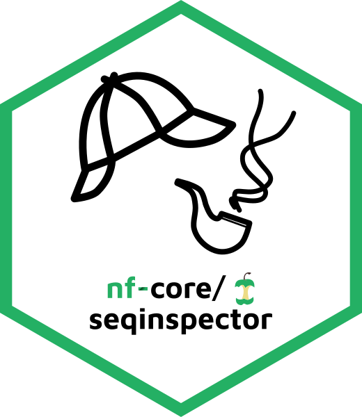
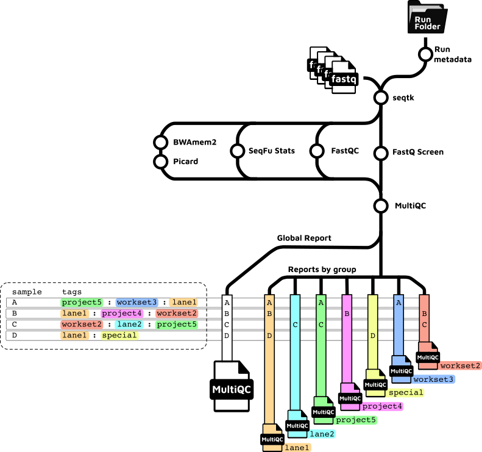

<h1>
  <picture>
    <source media="(prefers-color-scheme: dark)" srcset="docs/images/nf-core-seqinspector_logo_dark.png">
    
  </picture>
</h1>

[](https://github.com/codespaces/new/nf-core/seqinspector)
[](https://github.com/nf-core/seqinspector/actions/workflows/nf-test.yml)
[](https://github.com/nf-core/seqinspector/actions/workflows/linting.yml)[](https://nf-co.re/seqinspector/results)[](https://doi.org/10.5281/zenodo.XXXXXXX)
[](https://www.nf-test.com)

[](https://www.nextflow.io/)
[](https://github.com/nf-core/tools/releases/tag/3.5.1)
[](https://docs.conda.io/en/latest/)
[](https://www.docker.com/)
[](https://sylabs.io/docs/)
[](https://cloud.seqera.io/launch?pipeline=https://github.com/nf-core/seqinspector)

[](https://nfcore.slack.com/channels/seqinspector)[](https://bsky.app/profile/nf-co.re)[](https://mstdn.science/@nf_core)[](https://www.youtube.com/c/nf-core)

## Introduction

<picture>
  <source media="(prefers-color-scheme: dark)" srcset="docs/images/nf-core-seqinspector_logo_dark.png">
  <source media="(prefers-color-scheme: light)" srcset="docs/images/nf-core-seqinspector_logo_light.png">
  
</picture>

<picture>
  <source media="(prefers-color-scheme: dark)" srcset="docs/images/nfcore-seqinspector-logo-hex-dark.png">
  <source media="(prefers-color-scheme: light)" srcset="docs/images/nfcore-seqinspector-logo-hex-light.png">
  
</picture>

**nf-core/seqinspector** is a bioinformatics pipeline that that processes raw sequence data (FASTQ) to provide comprehensive quality control. It can perform subsampling, quality assessment, duplication level analysis, and complexity evaluation on a per-sample basis, while also detecting adapter content, technical artifacts, and common biological contaminants. The pipeline generates detailed MultiQC reports with flexible output options, ranging from individual sample reports to project-wide summaries, making it particularly useful for sequencing core facilities and research groups with access to sequencing instruments. If provided, nf-core/seqinspector can also parse statistics from an Illumina run folder directory into the final MultiQC reports.

<!-- TODO: add a search tool that accepts a tree for `Compatibility with Data`. -->

| Tool Type           | Tool Name                                                                                                   | Tool Description                                                                              | Compatibility with Data | Dependencies                    | Default tool |
| ------------------- | ----------------------------------------------------------------------------------------------------------- | --------------------------------------------------------------------------------------------- | ----------------------- | ------------------------------- | ------------ |
| `Subsampling`       | [`Seqtk`](https://github.com/lh3/seqtk)                                                                     | Global subsampling of reads. Only performs subsampling if `--sample_size` parameter is given. | [RNA, DNA, synthetic]   | [N/A]                           | no           |
| `Indexing, Mapping` | [`Bwamem2`](https://github.com/bwa-mem2/bwa-mem2)                                                           | Align reads to reference                                                                      | [RNA, DNA]              | [N/A]                           | yes          |
| `Indexing`          | [`SAMtools`](http://github.com/samtools)                                                                    | Index aligned BAM files, create FASTA index                                                   | [DNA]                   | [N/A]                           | yes          |
| `QC`                | [`FastQC`](https://www.bioinformatics.babraham.ac.uk/projects/fastqc/)                                      | Read QC                                                                                       | [RNA, DNA]              | [N/A]                           | yes          |
| `QC`                | [`FastqScreen`](https://www.bioinformatics.babraham.ac.uk/projects/fastq_screen/)                           | Basic contamination detection                                                                 | [RNA, DNA]              | [N/A]                           | yes          |
| `QC`                | [`SeqFu Stats`](https://github.com/telatin/seqfu2)                                                          | Sequence statistics                                                                           | [RNA, DNA]              | [N/A]                           | yes          |
| `QC`                | [`Picard collect multiple metrics`](https://broadinstitute.github.io/picard/picard-metric-definitions.html) | Collect multiple QC metrics                                                                   | [RNA, DNA]              | [Bwamem2, SAMtools, `--genome`] | yes          |
| `QC`                | [`Picard_collecthsmetrics`](https://gatk.broadinstitute.org/hc/en-us/articles/360036856051-CollectHsMetrics-Picard) | Collect alignment QC metrics of hybrid-selection data.                                | [RNA, DNA]              | [Bwamem2, SAMtools, `--fasta`, `--run_picard_collecths_metrics`, `--bait_intervals`, `--target_intervals` (`--ref_dict`)] | No |
| `Reporting`         | [`MultiQC`](http://multiqc.info/)                                                                           | Present QC for raw reads                                                                      | [RNA, DNA, synthetic]   | [N/A]                           | yes          |

<picture>
  <source media="(prefers-color-scheme: dark)" srcset="docs/images/seqinspector_tubemap_V1.0_dark.png">
  <source media="(prefers-color-scheme: light)" srcset="docs/images/seqinspector_tubemap_V1.0.png">
  
</picture>

## Usage

> [!NOTE]
> If you are new to Nextflow and nf-core, please refer to [this page](https://nf-co.re/docs/usage/installation) on how to set-up Nextflow. Make sure to [test your setup](https://nf-co.re/docs/usage/introduction#how-to-run-a-pipeline) with `-profile test` before running the workflow on actual data.

First, prepare a samplesheet with your input data that looks as follows:

`samplesheet.csv`:

```csv
sample,fastq_1,fastq_2,rundir,tags
CONTROL_REP1,AEG588A1_S1_L002_R1_001.fastq.gz,AEG588A1_S1_L002_R2_001.fastq.gz,200624_A00834_0183_BHMTFYDRXX,lane1:project5:group2
```

Each row represents a fastq file (single-end) or a pair of fastq files (paired end).

Now, you can run the pipeline using:

```bash
nextflow run nf-core/seqinspector \
   -profile <docker/singularity/.../institute> \
   --input samplesheet.csv \
   --outdir <OUTDIR>
```

> [!WARNING]
> Please provide pipeline parameters via the CLI or Nextflow `-params-file` option. Custom config files including those provided by the `-c` Nextflow option can be used to provide any configuration _**except for parameters**_; see [docs](https://nf-co.re/docs/usage/getting_started/configuration#custom-configuration-files).

For more details and further functionality, please refer to the [usage documentation](https://nf-co.re/seqinspector/usage) and the [parameter documentation](https://nf-co.re/seqinspector/parameters).

## Pipeline output

To see the results of an example test run with a full size dataset refer to the [results](https://nf-co.re/seqinspector/results) tab on the nf-core website pipeline page.
For more details about the output files and reports, please refer to the
[output documentation](https://nf-co.re/seqinspector/output).

## Credits

nf-core/seqinspector was originally written by the Swedish [@NationalGenomicsInfrastructure](https://github.com/NationalGenomicsInfrastructure/) and [Clinical Genomics Stockholm](https://clinical.scilifelab.se/).

We thank the following people for their extensive assistance in the development of this pipeline:

- [@mahesh-panchal](https://github.com/mahesh-panchal)

## Contributions and Support

If you would like to contribute to this pipeline, please see the [contributing guidelines](.github/CONTRIBUTING.md).

For further information or help, don't hesitate to get in touch on the [Slack `#seqinspector` channel](https://nfcore.slack.com/channels/seqinspector) (you can join with [this invite](https://nf-co.re/join/slack)).

## Citations

<!-- TODO nf-core: Add bibliography of tools and data used in your pipeline -->

An extensive list of references for the tools used by the pipeline can be found in the [`CITATIONS.md`](CITATIONS.md) file.

You can cite the `nf-core` publication as follows:

> **The nf-core framework for community-curated bioinformatics pipelines.**
>
> Philip Ewels, Alexander Peltzer, Sven Fillinger, Harshil Patel, Johannes Alneberg, Andreas Wilm, Maxime Ulysse Garcia, Paolo Di Tommaso & Sven Nahnsen.
>
> _Nat Biotechnol._ 2020 Feb 13. doi: [10.1038/s41587-020-0439-x](https://dx.doi.org/10.1038/s41587-020-0439-x).
