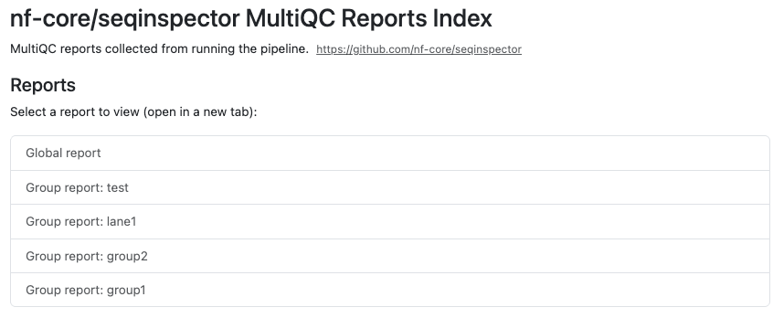

# nf-core/seqinspector: Output

## Introduction

This document describes the output produced by the pipeline.
Most of the plots are taken from the MultiQC report, which summarises results at the end of the pipeline.

The directories listed below will be created in the results directory after the pipeline has finished.
All paths are relative to the top-level results directory.

## Pipeline overview

The pipeline is built using [Nextflow](https://www.nextflow.io/) and can generate output files from the following steps:

- [References](#references) - Create missing indexes for a given fasta file
- [FQ](#fq) - Linting of FASTQ files to check for formatting issues
- [CheckQC](#checkqc) - QC of an Illumina run
- [Rundirparser](#rundirparser) - Parse rundir metadata from Illumina runs
- [ToulligQC](#toulligqc) - Raw read QC for Oxford Nanopore runs
- [SeqFu](#seqfu) - Statistics for FASTA or FASTQ files
- [BBMap Clumpify](#bbmap-clumpify) - FASTQ deduplication, compression and quality assessment
- [Seqtk](#seqtk) - Subsample a specific number of reads per sample
- [FastQC](#fastqc) - Raw read QC
- [Sequali](#sequali) - Sequence quality metrics for short and long reads
- [FASTQE](#fastqe) - Raw read QC
- [FastP](#fastp) - Trimming and filtering of raw reads
- [Chelae](#chelae) - Adapter and quality trimming of short-read FASTQ data
- [FastQ Screen](#fastq-screen) - Mapping against a set of references for basic contamination QC
- [BWA-MEM2_MEM](#bwamem2_mem) - Mapping reads against a chosen reference genome
- [Picard CollectHsMetrics](#picard-collecthsmetrics) - Collect alignment QC metrics of hybrid-selection data
- [Picard CollectMultipleMetrics](#picard-collectmultiplemetrics) - Combine BAM and BAI outputs for Picard
- [Riker](#riker) - BAM-level QC metrics collection
- [Kraken2](#kraken2) - Phylogenetic assignment of reads using k-mers
- [Krona](#krona) - Interactive visualization of Kraken2 results
- [MultiQC](#multiqc) - Aggregate report describing results and QC from the whole pipeline
- [SeqkitStats](#seqkitstats) - Per sample TSV file with summary statistics
- [Pipeline information](#pipeline-information) - Report metrics generated during the workflow execution

### References

The pipeline generates reference indices from a FASTA file when they are not provided via `--bwamem2`, `--fai`, or `--dict`.
Indices are only created if the active tools require them — if no alignment-based tools (Picard, Riker) are selected, no reference indices are generated.

<details markdown="1">
<summary>Output files</summary>

BWA-MEM2 index files generated with `bwa-mem2 index`.
Required by `picard_collecthsmetrics`, `picard_collectmultiplemetrics`, and `riker`.

- `references/bwamem2/`
  - `*.fa.amb`
  - `*.fa.ann`
  - `*.fa.bwt`
  - `*.fa.pac`

Fasta dictionary generated with `picard CreateSequenceDictionary`.
Required by `picard_collecthsmetrics`.

- `references/`
  - `*.dict`

Fasta index generated with `samtools faidx`.
Required by `picard_collecthsmetrics`, `picard_collectmultiplemetrics`, and `riker`.

- `references/`
  - `*.fa.fai`

</details>

### FQ

[FQ/lint](https://github.com/stjude-rust-labs/fq) validates FASTQ files for common formatting issues such as invalid characters, inconsistent quality encodings and read name problems.

<details markdown="1">
<summary>Output files</summary>

- `reports/fq/[sample_id]/`
  - `*.fq_lint.txt`: Linting report for each FASTQ file containing information about the formatting of the FASTQ file and any potential issues.

</details>

### CheckQC

[CheckQC](https://github.com/clinical-genomics-uppsala/CheckQC) validates sequencing metrics against predefined thresholds for the given instrument and flowcell configuration.

<details markdown="1">
<summary>Output files</summary>

- `reports/checkqc/[rundir]/`
  - `checkqc_report.json`: Reports sequencing metrics that are not fulfilled. Note that the CheckQC module in MultiQC currently does not support BCL Convert data, so if the report if based on data from that demultiplexer it will not be visualized in the MultiQC report. Results can be found in the output directory.

</details>

### Rundirparser

[Rundirparser](https://github.com/nf-core/seqinspector) extracts run metadata from Illumina run directories by parsing the `runParameters.xml` file and generates a MultiQC-compatible YAML report.

<details markdown="1">
<summary>Output files</summary>

- `reports/rundirparser/[rundir]/`
  - `[rundir]_illumina_mqc.yml`: Reports sequencing metrics. This is done via a custom script that can be found in `bin/parse_illumina.py` that parses the `runParameters.xml` file. The resulting YAML file is formatted to be read by MultiQC. Results can be found in the output directory.

</details>

### ToulligQC

[ToulligQC](https://github.com/GenomiqueENS/toulligQC) is dedicated to the QC analyses of Oxford Nanopore runs.
This software is written in Python and developed by the GenomiqueENS core facility of the Institute of Biology of the Ecole Normale Superieure (IBENS).

<details markdown="1">
<summary>Output files</summary>

- `reports/toulligqc/[sample_id]/`
  - `*.data`: ToulligQC output text file containing log information and all analysis results.
  - `*.html`: ToulligQC html report file.

</details>

### SeqFu

[SeqFu](https://telatin.github.io/seqfu2/) is general-purpose program to manipulate and parse information from FASTA/FASTQ files, supporting gzipped input files.
Includes functions to interleave and de-interleave FASTQ files, to rename sequences and to count and print statistics on sequence lengths.

<details markdown="1">
<summary>Output files</summary>

- `reports/seqfu/[sample_id]/`
  - `*.tsv`: Tab-separated file containing quality metrics.
  - `*_mqc.txt`: File containing the same quality metrics as the TSV file, ready to be read by MultiQC.

</details>

In this pipeline, the `seqfu stats` module is used to produce general quality metrics statistics.

### BBMap Clumpify

[BBMap Clumpify](https://jgi.doe.gov/data-and-tools/software-tools/bbtools/bb-tools-user-guide/clumpify-guide/) reorders reads for better compression and marks duplicates by appending `duplicate` to read names.
The log reports duplication statistics for QC purposes.
When `--save_bbmap_clumpify_reads` is enabled, the clumped FASTQ files are published to `bbmap/[sample_id]/`.

<details markdown="1">
<summary>Output files</summary>

- `bbmap/[sample_id]/`
  - `*.clumped.fastq.gz`: Clumped (and optionally deduplicated) FASTQ files.
- `reports/bbmap/[sample_id]/`
  - `*.clumpify.log`: Log file with duplication statistics.

</details>

The tool arguments can be customised via `--bbmap_clumpify_args`.
By default, `markduplicates=true` is used to mark duplicates.
To remove duplicates entirely, add `dedupe=true`:

```bash
--bbmap_clumpify_args 'markduplicates=true dedupe=true'
```

### Seqtk

[Seqtk](https://github.com/lh3/seqtk) samples sequences randomly using reservoir sampling with a fixed seed (`-s100`) for reproducibility.

<details markdown="1">
<summary>Output files</summary>

- `subsampled/[sample_id]/`
  - `*.fastq.gz`: FastQ files after being subsampled to the sample_size value.

</details>

By default, only specific tools run on the subsampled data.
Use `--subsample_tools` to control which tools receive subsampled reads (see [Usage](https://nf-co.re/seqinspector/docs/usage#subsampling-control)).

### FastQC

[FastQC](http://www.bioinformatics.babraham.ac.uk/projects/fastqc/) gives general quality metrics about your sequenced reads.
It provides information about the quality score distribution across your reads, per base sequence content (%A/T/G/C), adapter contamination and overrepresented sequences.

<details markdown="1">
<summary>Output files</summary>

- `reports/fastqc/[sample_id]/`
  - `*_fastqc.html`: FastQC report containing quality metrics.
  - `*_fastqc.zip`: Zip archive containing the FastQC report, tab-delimited data file and plot images.

</details>

For further reading and documentation see the [FastQC help pages](http://www.bioinformatics.babraham.ac.uk/projects/fastqc/Help/).

### Sequali

[Sequali](https://sequali.readthedocs.io/en/latest/) gives general quality metrics for short and long sequenced reads.
It provides information about the quality score distribution across your reads, GC content, duplication levels, length distribution, adapter contamination (Illumina and Oxford Nanopore) and overrepresented sequences.

<details markdown="1">
<summary>Output files</summary>

- `reports/sequali/[sample_id]/`
  - `*.html`: Sequali report containing quality metrics.
  - `*.json`: JSON containing the Sequali data, used for generating MultiQC report.

</details>

### FASTQE

[FASTQE](https://fastqe.com/) Compute quality stats for FASTQ files and print those stats as emoji... for some reason.

<details markdown="1">
<summary>Output files</summary>

- `reports/fastqe/[sample_id]/`
  - `*.tsv`: FASTQE report containing quality metrics in emoji.

</details>

### Chelae

[Chelae](https://github.com/fulcrumgenomics/chelae) is a fast, accurate, multi-threaded toolkit for trimming and filtering short-read FASTQ data.
It produces a fastp-compatible JSON report suitable for MultiQC, as well as a TSV metrics summary.

<details markdown="1">
<summary>Output files</summary>

- `chelae/[sample_id]/`
  - `*.chelae.fastq.gz`: Trimmed FASTQ file(s).
- `reports/chelae/[sample_id]/`
  - `*.chelae.json`: Chelae JSON trimming report (fastp-compatible).
  - `*.chelae.tsv`: Chelae trimming metrics summary.

</details>

### FastP

[FastP](https://github.com/OpenGene/fastp) is a tool designed to provide all-in-one preprocessing for FastQ files and as such is used for trimming and splitting.
The resulting trimmed files are not published.
We only keep the reports for MultiQC and the pipeline report.

<details markdown="1">
<summary>Output files</summary>

- `reports/fastp/[sample_id]/`
  - `*.fastp.html`: FastP HTML report.
  - `*.fastp.json`: FastP report containing quality metrics in JSON format.
  - `*.fastp.log`: FastP log file containing quality metrics.

</details>

### FastQ Screen

[FastQ Screen](https://www.bioinformatics.babraham.ac.uk/projects/fastq_screen/) allows you to set up a standard set of references against which all of your samples can be mapped.
Your references might contain the genomes of all of the organisms you work on, along with PhiX, vectors or other contaminants commonly seen in sequencing experiments.

<details markdown="1">
<summary>Output files</summary>

- `reports/fastqscreen/[sample_id]/`
  - `*_screen.html`: Interactive graphical report.
  - `*_screen.png`: Static graphical report.
  - `*_screen.txt`: Text-based report.

</details>

To use FastQ Screen, this pipeline requires a `.csv` detailing:

- the working name of the reference
- the name of the aligner used to generate its index (which is also the aligner and index used by the tool)
- the file basename of the reference and its index (e.g. the reference `genome.fa` and its index `genome.bt2` have the basename `genome`)
- the path to a dir where the reference and index files both reside.

See `assets/example_fastq_screen_references.csv` for example.

The `.csv` is provided as a pipeline parameter `fastq_screen_references` and is used to construct a `FastQ Screen` configuration file within the context of the process work directory in order to properly mount the references.

### BWAMEM2_MEM

[BWA-mem2](https://github.com/bwa-mem2/bwa-mem2) is an improved version of BWA-mem for mapping sequences with low divergence against a reference genome with increased processing speed (~1.3-3.1x).
Aligned reads are then sorted using [samtools](#samtools) in the same process, and the resulting BAM files are then indexed with `samtools index`.

<details markdown="1">
<summary>Output files</summary>

- `mapped/[sample_id]/`
  - `*.bam`: The original BAM file containing read alignments to the reference genome.
  - `*.bam.bai`: BAM index files via samtools.

</details>

### Picard CollectHSmetrics

[Picard_collecthsmetrics](https://gatk.broadinstitute.org/hc/en-us/articles/360036856051-CollectHsMetrics-Picard) is a tool to collect metrics on the alignment SAM/BAM files that are specific for sequence datasets generated through hybrid-selection (mostly used to capture exon-specific sequences for targeted sequencing).

<details markdown="1">
<summary>Output files</summary>

- `reports/picard_collecthsmetrics/[sample_id]/`
  - `*.coverage_metrics`: Tab-separated file containing quality metrics for hybrid-selection data.

</details>

### Picard CollectMultipleMetrics

[Picard CollectMultipleMetrics](https://broadinstitute.github.io/picard/) runs multiple Picard tools in a single pass to collect alignment, base distribution, quality and read length metrics from BAM files.

<details markdown="1">
<summary>Output files</summary>

- `reports/picard_collectmultiplemetrics/[sample_id]/`
  - `*.CollectMultipleMetrics.alignment_summary_metrics`
  - `*.CollectMultipleMetrics.base_distribution_by_cycle_metrics`
  - `*.CollectMultipleMetrics.base_distribution_by_cycle.pdf`
  - `*.CollectMultipleMetrics.quality_by_cycle_metrics`
  - `*.CollectMultipleMetrics.quality_by_cycle.pdf`
  - `*.CollectMultipleMetrics.quality_distribution.pdf`
  - `*.CollectMultipleMetrics.read_length_histogram.pdf`

</details>

### Riker

[Riker](https://github.com/fulcrumgenomics/riker) is a fast Rust CLI toolkit for sequencing QC metrics.
It ports key QC metrics tools from Picard with cleaner output and better performance.
When `--bait_intervals` and `--target_intervals` are provided, Riker also generates hybrid capture (hybcap) metrics.
To generate RNA metrics (`rna-metrics`, `rna-biotype`, `rna-insert-size`), provide `--rna_gene_model` (a GTF/GFF)
and add `rna` to `--riker_args` (e.g. `--riker_args "--tools alignment basic isize rna"`).
Optionally supply `--rna_ribosomal_intervals` to union explicit rRNA intervals with those derived from the gene model.

<details markdown="1">
<summary>Output files</summary>

- `reports/riker/[sample_id]/`
  - `*.alignment-metrics.txt`: Alignment summary metrics.
  - `*.base-distribution-by-cycle.txt`: Base distribution by cycle.
  - `*.mean-quality-by-cycle.txt`: Mean quality by cycle.
  - `*.quality-score-distribution.txt`: Quality score distribution.
  - `*.error-mismatch.txt`: Base mismatch error metrics.
  - `*.error-overlap.txt`: Read overlap error metrics.
  - `*.error-indel.txt`: Indel error metrics.
  - `*.gcbias-detail.txt`: Per-GC-bin detail metrics.
  - `*.gcbias-summary.txt`: GC bias summary metrics.
  - `*.isize-metrics.txt`: Insert size summary metrics.
  - `*.isize-histogram.txt`: Insert size histogram.
  - `*.wgs-metrics.txt`: Whole-genome coverage summary metrics.
  - `*.wgs-coverage.txt`: Per-depth coverage histogram.

</details>

### Kraken2

[Kraken](https://ccb.jhu.edu/software/kraken2/) is a taxonomic sequence classifier that assigns taxonomic labels to DNA sequences.
Kraken examines the k-mers within a query sequence and uses the information within those k-mers to query a database.
That database maps -mers to the lowest common ancestor (LCA) of all genomes known to contain a given k-mer.

<details markdown="1">
<summary>Output files</summary>

- `reports/kraken2/[sample_id]/`
  - `<sample>.kraken2.report.txt`: A report containing information on the phylogenetic assignment of reads in a given sample.
  - `<db_name>/`
    - `<sample_id>_<db_name>.classified.fastq.gz`: FASTQ file containing all reads that had a hit against a reference in the database for a given sample.
    - `<sample_id>_<db_name>.unclassified.fastq.gz`: FASTQ file containing all reads that did not have a hit in the database for a given sample.
    - `<sample_id>_<db_name>.classifiedreads.txt`: A list of read IDs and the hits each read had against each database for a given sample.

</details>

The main taxonomic classification file from Kraken2 is the `*report.txt` file.
It gives you the most information for a single sample.
You will only receive the `.fastq` and `*classifiedreads.txt` file if you supply `--kraken2_save_reads` and/or `--kraken2_save_readclassifications` parameters to the pipeline.

### Krona

[Krona](https://github.com/marbl/Krona) allows the exploration of (metagenomic) hierarchical data with interactive zooming, multi-layered pie charts.

Krona charts will be generated by the pipeline for supported tools (Kraken2, Centrifuge, Kaiju, and MALT).

<details markdown="1">
<summary>Output files</summary>

- `reports/kraken2/krona/[sample_id]/`
  - `<tool_name>_<db_name>.html`: per-tool/per-database interactive HTML file containing hierarchical pie charts.

</details>

The resulting HTML files can be loaded into your web browser for exploration.
Each file will have a dropdown to allow you to switch between each sample aligned against the given database of the tool.

### MultiQC

nf-core/seqinspector will generate the following MultiQC reports:

- one global report including all the samples listed in the samplesheet.
- one group report per unique tag, these reports compile samples that share the same tag.

<details markdown="1">
<summary>Output files</summary>

- `multiqc/`
  - `global_report`
    - `multiqc_report.html`: a standalone HTML file that can be viewed in your web browser.
    - `multiqc_data/`: directory containing parsed statistics from the different tools used in the pipeline.
    - `multiqc_plots/`: directory containing static images from the report in various formats.
  - `group_reports`
    - `tag1/`
      - `multiqc_report.html`
      - `multiqc_data/`
      - `multiqc_plots/`
    - `tag2/`
      - `multiqc_report.html`
      - `multiqc_data/`
      - `multiqc_plots/`
    - ...

</details>

[MultiQC](https://seqera.io/multiqc/) is a visualization tool that generates a single HTML report summarising all samples in your project.
Most of the pipeline QC results are visualised in the report and further statistics are available in the report data directory.

Results generated by MultiQC collate pipeline QC from supported tools e.g. FastQC.
The pipeline has special steps which also allow the software versions to be reported in the MultiQC output for future traceability.
For more information about how to use MultiQC reports, see <https://seqera.io/multiqc/>.

The MultiQC global report might also contain metrics related to the rundir via the [MULTIQC_SAV](https://github.com/MultiQC/MultiQC_SAV) plugin.

#### Subsampling notice

:::note
This section of the MultiQC report will only be present if the `--sample_size` parameter is used when running the pipeline.
:::

List which tools have been run on the subsampled reads.

#### nf-core/seqinspector MultiQC Reports Index



Index to jump between the global and grouped reports from within the current MultiQC report.

:::warning
This section works when the report is opened in the directory structure generated by the pipeline, and not when the report is moved to a different location.
:::

### SeqkitStats

[SeqkitStats](https://bioinf.shenwei.me/seqkit/usage/#stats) it gives simple statistics such as number of sequences, min/max_len, N50, Q20%, Q30% and GC%.

<details markdown="1">
<summary>Output files</summary>

- `seqkit/`
  - `*.tsv`: Per sample TSV file with summary statistics.

</details>

For further reading and documentation see the [Seqkit help pages](https://bioinf.shenwei.me/seqkit/).

### Pipeline information

<details markdown="1">
<summary>Output files</summary>

- `pipeline_info/`
  - Reports generated by Nextflow: `execution_report.html`, `execution_timeline.html`, `execution_trace.txt` and `pipeline_dag.dot`/`pipeline_dag.svg`.
  - Reports generated by the pipeline: `pipeline_report.html`, `pipeline_report.txt` and `software_versions.yml`. The `pipeline_report*` files will only be present if the `--email` / `--email_on_fail` parameter's are used when running the pipeline.
  - Parameters used by the pipeline run: `params.json`.

</details>

[Nextflow](https://docs.seqera.io/platform-cloud/reports/overview) provides excellent functionality for generating various reports relevant to the running and execution of the pipeline. This will allow you to troubleshoot errors with the running of the pipeline, and also provide you with other information such as launch commands, run times and resource usage.
